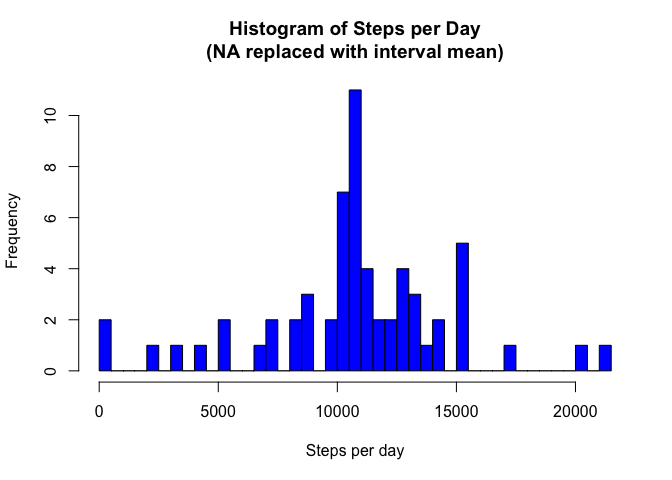

# Reproducible Research: Peer Assessment 1


## Loading and preprocessing the data
* check if csv is exists.
* read csv

```r
if(!file.exists('activity.csv')){
    unzip('activity.zip')
}
activity<-read.csv("activity.csv")
```


## What is mean total number of steps taken per day?
* calculate the sum of step by date
* plot histogram, let break be the number of unique totalSteps
* ouput the mean of total number of steps per day
* output the median of total number of steps per day

```r
totalStep<-aggregate(steps~date,activity,sum,na.action=na.omit)
hist(totalStep$steps,breaks=length(unique(totalStep)[[1]]),
     col="blue",xlab="Steps per day",main="Histogram of Steps per Day")
```


```r
cat("Mean of total number of steps per day: ",mean(totalStep$steps),"\n")
```

```
## Mean of total number of steps per day:  10766.19
```

```r
cat("Median of total number of steps per day: ",median(totalStep$steps),"\n")
```

```
## Median of total number of steps per day:  10765
```


## What is the average daily activity pattern?
* calculate the average of step by date
* plot time series plot of the average number of steps taken using type="l"
* output the interval which contains max average steps


```r
averageStep<-aggregate(steps~interval,activity,mean)
with(averageStep, plot(interval,steps,type="l",col="red",
                       xlab="Interval(minutes)",ylab="steps(average)",
                       main="Average Steps Taken"))
```


```r
cat("The interval contians max average steps:",
    averageStep[which.max(averageStep$steps),1],"\n")
```

```
## The interval contians max average steps: 835
```


## Imputing missing values
* output total number of missing values
* create another new set of the activity data, which missing data is to be filled in
* using for loop to check every entry. fill in missing data with average step of that specific interval
* using the new data set (with all NA replaced by average), calculate the sum of step by date
* plot histograme
* output mean steps (NA replaced)
* output median steps (NA replaced)

```r
cat("Total number of missing values: ",sum(is.na(activity$steps)),"\n")
```

```
## Total number of missing values:  2304
```

```r
activity_new<-activity
for(i in 1:nrow(activity_new)) {
    if(is.na(activity_new[i,"steps"])) {
        activity_new[i,"steps"]<-subset(averageStep,interval==activity_new[i,"interval"])$steps
    }
}
totalStep_new<-aggregate(steps~date,activity_new,sum)
hist(totalStep_new$steps,breaks=length(unique(totalStep_new)[[1]]),
     col="blue",xlab="Steps per day",main="Histogram of Steps per Day\n(NA replaced with interval mean)")
```



```r
cat("Mean of total number of steps per day (NA replaced): ",mean(totalStep_new$steps),"\n")
```

```
## Mean of total number of steps per day (NA replaced):  10766.19
```

```r
cat("Median of total number of steps per day (NA replaced: ",median(totalStep_new$steps),"\n")
```

```
## Median of total number of steps per day (NA replaced:  10766.19
```


## Are there differences in activity patterns between weekdays and weekends?
* library dplyr, and use mutate to create new factor to the data showing "weekend" or "weekday"
* library lattice, an plot average steps of weekend and another of weekday

```r
library(dplyr)
```

```
## 
## Attaching package: 'dplyr'
```

```
## The following objects are masked from 'package:stats':
## 
##     filter, lag
```

```
## The following objects are masked from 'package:base':
## 
##     intersect, setdiff, setequal, union
```

```r
activity_new<-mutate(activity_new,weekday=ifelse(weekdays(as.Date(activity$date)) %in% c("Saturday","Sunday"),"weekend","weekday"))
library(lattice)
averageStep_new<-aggregate(steps~interval+weekday,activity_new,mean)
xyplot(steps ~ interval | weekday, averageStep_new, type = "l", layout = c(1, 2), 
       xlab = "Interval", ylab = "Number of steps")
```


